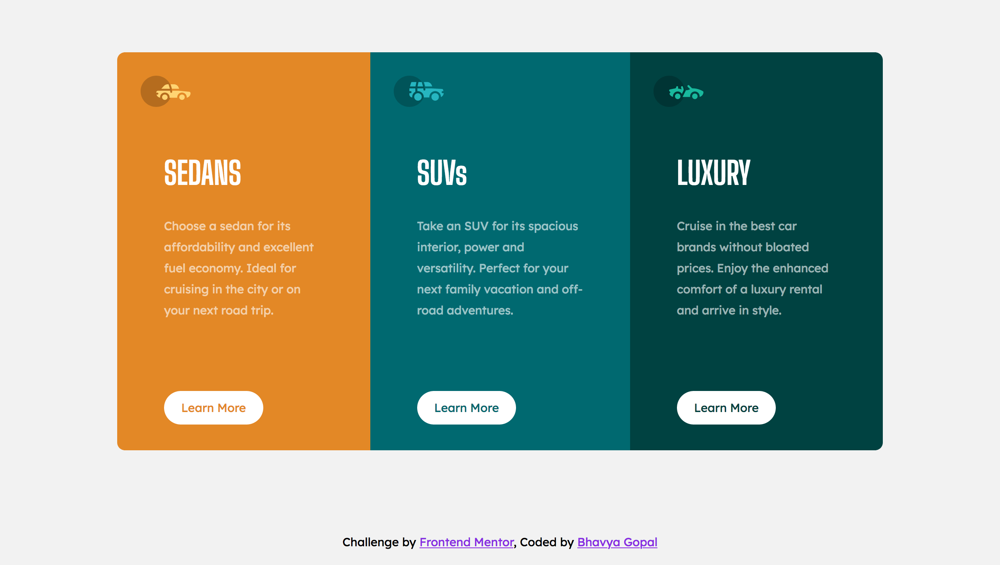
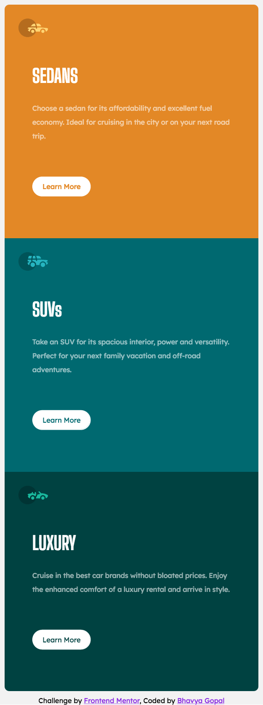

# Frontend Mentor: 3-column preview card component solution

This is a solution to the [3-column preview card component challenge on Frontend Mentor](https://www.frontendmentor.io/challenges/3column-preview-card-component-pH92eAR2-). Frontend Mentor challenges help you improve your coding skills by building realistic projects. 

## Table of contents

  - [The challenge](#the-challenge)
  - [Screenshot](#screenshot)
  - [Links](#links)  
  - [Built with](#built-with)
  - [Useful resources](#useful-resources)
  - [Acknowledgments](#acknowledgments)

### The Challenge

Users should be able to:

- View the optimal layout depending on their device's screen size
- See hover states for interactive elements

### Screenshots

### Links

- Live Site URL: [Add live site URL here](https://your-live-site-url.com)

### Built with

- Semantic HTML5 markup
- CSS3
- Flexbox
- Mobile-first workflow

### Useful resources

- [W3Schools](https://www.w3schools.com/html/) 
- [FreeCodeCamp](https://www.freecodecamp.org/learn/responsive-web-design/)
- [CSS-Tricks](https://css-tricks.com/)

### Acknowledgments

I would like to thank [Nandini Proothi](https://github.com/nandiniproothi) and [Kevin Powell's discord community](https://discord.gg/eHFXk8V2) for their support in helping me complete my first front-end project!

